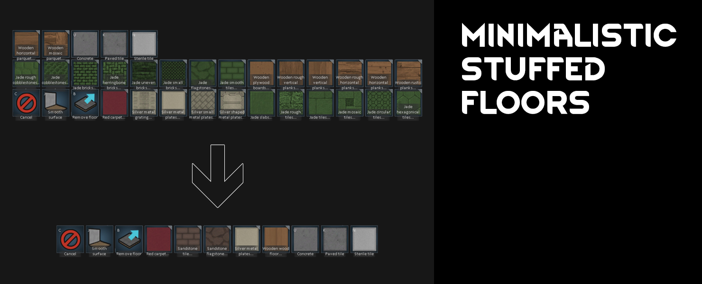

# [JPT] Minimalistic Stuffed Floors
[**>>> DOWNLOAD IT HERE <<<**](https://github.com/jptrrs/MinimalisticStuffedFloors/releases/latest)

Removes all the clutter from [Fluffy's Stuffed Floors](https://steamcommunity.com/sharedfiles/filedetails/?id=853043503), leaving just the two vanilla floors that were really lacking: the **wood floor** (to use with [Expanded Woodworking](https://steamcommunity.com/sharedfiles/filedetails/?id=1082915328)) and the **metal tiles** (grouped into one icon and enabled for modded metals). Both keep their vanilla stats and textures. 

 

WARNING: Adding this to a saved game which already uses tiles from the regular Stuffed Floors will result in errors and those tiles will be deleted. I recommend removing those first. Other than that, this is perfectly save compatible.
